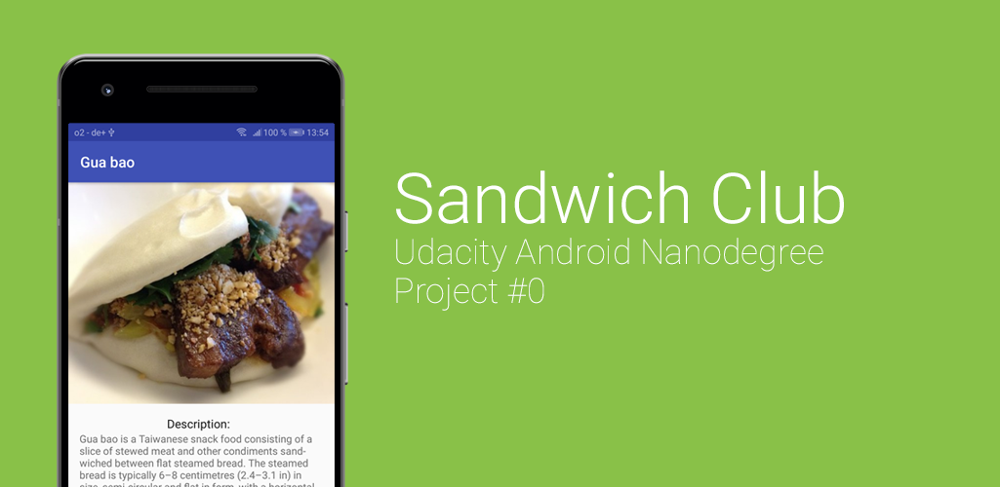

#Sandwich Club Project Starter Code

## Project Overview
In this project, you will complete the **Sandwich Club** app to
show the details of each sandwich once it is selected.

## What i did
- Processed the JSON data (parsed it)
  - separated it into Strings
  - looped through the List
  - returned a new build 'Sandwich'
- Build/Designed the DetailActivity layout
  - ScrollView + ConstraintLayout
  - resized & 'centercroped' the Picture via picasso
- Populated the UI
